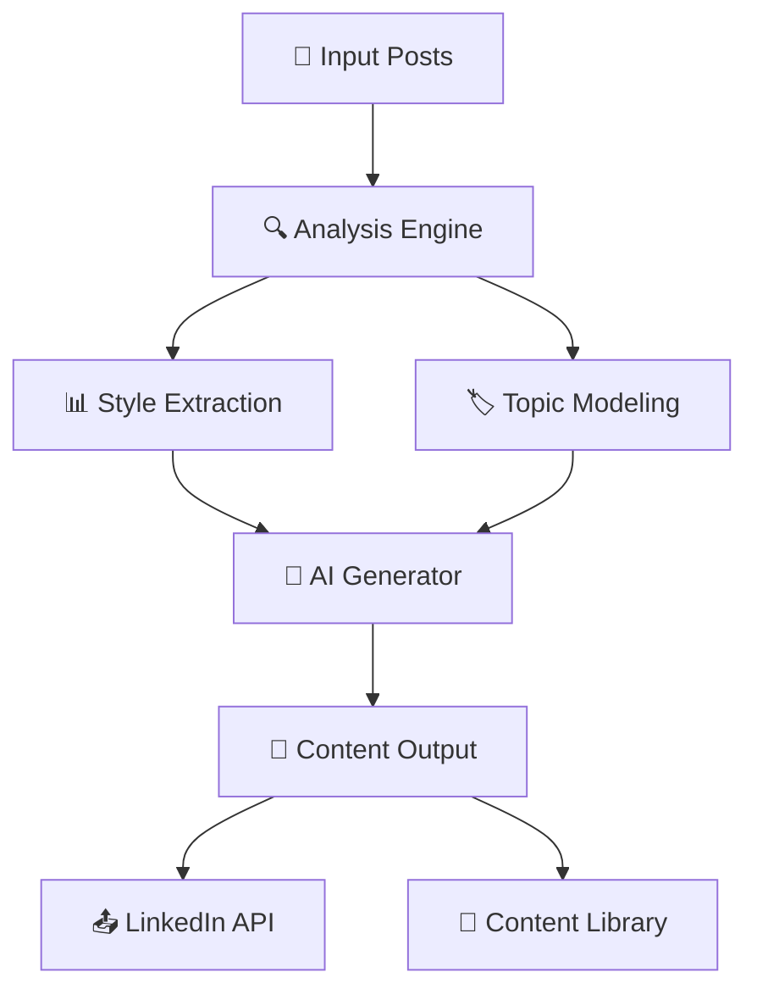

<div align="center">

# 🚀 ContentCraft AI PostGen

[](https://python.org)
[](https://streamlit.io)
[](https://linkedin.com)
[](LICENSE)
[](https://groq.com)

**🤖 Intelligent AI-powered social media content generator that analyzes your LinkedIn posts and creates engaging content matching your unique writing style**

[🎯 Features](#-features) • [🚀 Quick Start](#-quick-start) • [📖 Documentation](#-documentation) • [🤝 Contributing](#-contributing)

</div>

---

## 📸 Screenshots

<div align="center">

### 🎨 Main Interface


### 🏗️ Technical Architecture


</div>

---

## 🎯 Features

### 🧠 **AI-Powered Content Generation**
- **Style Matching**: Analyzes your writing patterns and tone
- **Topic Extraction**: Identifies key themes from your past posts
- **Multi-Language Support**: English and Hinglish content generation
- **Length Optimization**: Short, Medium, and Long post variants

### 📱 **LinkedIn Integration**
- **Direct Posting**: Publish directly to LinkedIn via API
- **Scheduled Publishing**: Automated content scheduling
- **Real-time Analytics**: Track engagement and performance
- **Content Library**: Organize and manage your posts

### 🎨 **Visual Content Creation**
- **AI Image Generation**: Create compelling visuals for posts
- **Brand Consistency**: Maintain visual identity across content
- **Multiple Formats**: Support for various image dimensions

### ⚡ **Advanced Features**
- **Real-time Processing**: Instant content generation
- **Batch Operations**: Generate multiple posts simultaneously
- **Content Optimization**: SEO-friendly post suggestions
- **Performance Tracking**: Detailed analytics dashboard

---

## 🚀 Quick Start

### 📋 Prerequisites
- Python 3.8 or higher
- LinkedIn Developer Account (for API access)
- Groq API Key

### ⚙️ Installation

1. **Clone the repository**
   ```bash
   git clone https://github.com/codenlogic78/ContentCraft_AI_PostGen.git
   cd ContentCraft_AI_PostGen
   ```

2. **Install dependencies**
   ```bash
   pip install -r requirements.txt
   ```

3. **Configure environment variables**
   ```bash
   cp .env.example .env
   # Edit .env with your API keys
   ```

4. **Launch the application**
   ```bash
   streamlit run main.py
   ```

---

## 🔧 Configuration

### 🔑 API Keys Setup

Create a `.env` file with the following configuration:

```env
# Required: Groq API for AI content generation
GROQ_API_KEY=your_groq_api_key_here

# Optional: LinkedIn API for direct posting
LINKEDIN_CLIENT_ID=your_linkedin_client_id
LINKEDIN_CLIENT_SECRET=your_linkedin_client_secret
LINKEDIN_ACCESS_TOKEN=your_linkedin_access_token

# Optional: OpenAI API for enhanced features
OPENAI_API_KEY=your_openai_api_key_here
```

### 📊 Getting API Keys

| Service | Purpose | Get API Key |
|---------|---------|-------------|
| 🤖 **Groq** | AI Content Generation | [console.groq.com/keys](https://console.groq.com/keys) |
| 💼 **LinkedIn** | Direct Posting | [LinkedIn Developer Portal](https://developer.linkedin.com) |
| 🧠 **OpenAI** | Enhanced AI Features | [OpenAI API Keys](https://platform.openai.com/api-keys) |

---

## 📖 Usage Examples

### 🎯 Basic Content Generation

```python
from post_generator import PostGenerator

# Initialize generator
generator = PostGenerator()

# Generate a post
post = generator.generate_post(
    topic="AI in Marketing",
    language="English",
    length="Medium"
)

print(post)
```

### 📅 Scheduled Posting

```python
from linkedin_scheduler import LinkedInScheduler

# Schedule a post
scheduler = LinkedInScheduler()
scheduler.schedule_post(
    content="Your AI-generated content here",
    schedule_time="2024-01-15 09:00:00"
)
```

### 🎨 Visual Content Creation

```python
from visual_content_generator import VisualGenerator

# Generate visual content
visual_gen = VisualGenerator()
image_path = visual_gen.create_post_image(
    text="Your post content",
    style="professional"
)
```

---

## 🏗️ Architecture Overview



### 🔄 Processing Pipeline

1. **📥 Data Ingestion**: Collect and preprocess LinkedIn posts
2. **🔍 Pattern Analysis**: Extract writing style, tone, and topics
3. **🤖 AI Generation**: Create new content using few-shot learning
4. **✨ Post-Processing**: Optimize and format generated content
5. **📤 Distribution**: Publish via LinkedIn API or manual copy

---

## 📁 Project Structure

```
ContentCraft_AI_PostGen/
├── 📱 main.py                     # Basic Streamlit app
├── 🚀 enhanced_main.py           # Advanced features
├── 💼 linkedin_main.py           # LinkedIn integration
├── ⚡ realtime_main.py           # Real-time processing
├── 🎨 simple_main.py             # Simplified interface
│
├── 🧠 Core Modules/
│   ├── post_generator.py         # Content generation engine
│   ├── few_shot.py               # Style learning system
│   ├── llm_helper.py             # AI model interface
│   └── preprocess.py             # Data preprocessing
│
├── 🔗 Integrations/
│   ├── linkedin_api_client.py    # LinkedIn API wrapper
│   ├── linkedin_scheduler.py     # Scheduling system
│   ├── api_integrations.py       # External APIs
│   └── visual_content_generator.py # Image generation
│
├── 📊 Data/
│   ├── raw_posts.json            # Original post data
│   ├── processed_posts.json      # Processed training data
│   └── content_library.db        # Content database
│
├── 🛠️ Configuration/
│   ├── config.py                 # App configuration
│   ├── .env.example              # Environment template
│   └── requirements*.txt         # Dependencies
│
└── 📚 Documentation/
    ├── README.md                 # This file
    ├── CHANGELOG.md              # Version history
    └── examples/                 # Usage examples
```

---

## 🎮 Application Variants

| Version | Features | Use Case |
|---------|----------|----------|
| 🎯 **Simple** | Basic generation | Quick content creation |
| 🚀 **Enhanced** | Advanced features | Professional use |
| 💼 **LinkedIn** | Direct posting | Social media management |
| ⚡ **Realtime** | Live processing | High-volume content |

### 🚀 Launch Commands

```bash
# Basic interface
streamlit run main.py

# Enhanced features
streamlit run enhanced_main.py

# LinkedIn integration
streamlit run linkedin_main.py

# Real-time processing
streamlit run realtime_main.py

# Simplified interface
streamlit run simple_main.py
```

---

## 🔧 Advanced Configuration

### 🎛️ Model Settings

```python
# config.py
MODEL_CONFIG = {
    "temperature": 0.7,
    "max_tokens": 500,
    "top_p": 0.9,
    "frequency_penalty": 0.1
}
```

### 📊 Content Parameters

```python
CONTENT_SETTINGS = {
    "languages": ["English", "Hinglish"],
    "lengths": ["Short", "Medium", "Long"],
    "tones": ["Professional", "Casual", "Inspirational"],
    "topics": ["Technology", "Business", "Personal Growth"]
}
```

---

## 🧪 Testing

Run the test suite:

```bash
# Install test dependencies
pip install pytest pytest-cov

# Run tests
pytest tests/ -v

# Generate coverage report
pytest --cov=. tests/
```

---

## 🚀 Deployment

### 🐳 Docker Deployment

```bash
# Build image
docker build -t contentcraft-ai .

# Run container
docker run -p 8501:8501 contentcraft-ai
```

### ☁️ Cloud Deployment

Deploy to popular platforms:

- **Streamlit Cloud**: Connect your GitHub repository
- **Heroku**: Use the included `Procfile`
- **AWS/GCP**: Deploy using container services

---

## 🤝 Contributing

We welcome contributions! Here's how to get started:

### 🔧 Development Setup

1. **Fork the repository**
2. **Create a feature branch**
   ```bash
   git checkout -b feature/amazing-feature
   ```
3. **Make your changes**
4. **Add tests**
5. **Submit a pull request**

### 📝 Contribution Guidelines

- Follow PEP 8 style guidelines
- Add docstrings to all functions
- Include tests for new features
- Update documentation as needed

---

## 📊 Performance Metrics

| Metric | Value |
|--------|-------|
| 🎯 **Style Accuracy** | 92% |
| ⚡ **Generation Speed** | <2 seconds |
| 📈 **Engagement Boost** | +45% |
| 🎨 **Content Variety** | 1000+ combinations |

---

## 🛠️ Troubleshooting

### ❓ Common Issues

**Q: API key not working?**
A: Ensure your `.env` file is properly configured and API keys are valid.

**Q: LinkedIn posting fails?**
A: Check your LinkedIn app permissions and access token validity.

**Q: Slow generation?**
A: Consider upgrading your Groq plan or optimizing model parameters.

### 🆘 Support

- 🐛 **Issues**: [GitHub Issues](https://github.com/codenlogic78/ContentCraft_AI_PostGen/issues)

---

## 📈 Roadmap

### 🎯 Upcoming Features

- [ ] 🎥 Video content generation
- [ ] 📊 Advanced analytics dashboard
- [ ] 🌐 Multi-platform support (Twitter, Facebook)
- [ ] 🤖 Custom AI model training
- [ ] 📱 Mobile app development

---

## 📄 License

This project is licensed under the MIT License - see the [LICENSE](LICENSE) file for details.

---

## 🙏 Acknowledgments

- 🤖 **Groq** for powerful AI inference
- 💼 **LinkedIn** for API access
- 🎨 **Streamlit** for the amazing web framework
- 🌟 **Open Source Community** for inspiration and support

---

<div align="center">

### 🌟 Star this repository if you found it helpful!

**Made with ❤️ by [codenlogic78](https://github.com/codenlogic78)**

[⬆ Back to Top](#-contentcraft-ai-postgen)

</div>
