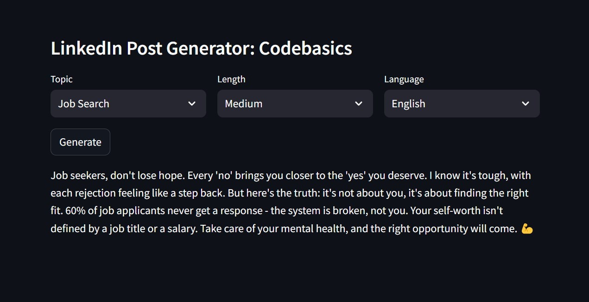

# ContentCraft AI PostGen
An intelligent AI-powered social media content generator that analyzes your past LinkedIn posts and creates new engaging content that matches your unique writing style and voice  



ContentCraft AI PostGen empowers content creators, professionals, and influencers to maintain consistent, high-quality social media presence. Simply feed your past LinkedIn posts to the system, and it will analyze your writing patterns, extract key topics, and generate new posts that perfectly match your authentic voice and style. 

## Technical Architecture


1. Stage 1: Collect LinkedIn posts and extract Topic, Language, Length etc. from it.
1. Stage 2: Now use topic, language and length to generate a new post. Some of the past posts related to that specific topic, language and length will be used for few shot learning to guide the LLM about the writing style etc.

## Set-up
1. To get started we first need to get an API_KEY from here: https://console.groq.com/keys. Inside `.env` update the value of `GROQ_API_KEY` with the API_KEY you created. 
2. To get started, first install the dependencies using:
    ```commandline
     pip install -r requirements.txt
    ```
3. Run the streamlit app:
   ```commandline
   streamlit run main.py
   ```
## License
MIT License - Feel free to use, modify, and distribute this project.

## Author
Developed with ❤️ for content creators worldwide.

**Note:** This project is inspired by modern AI content generation techniques and is designed to help professionals maintain authentic social media presence.
